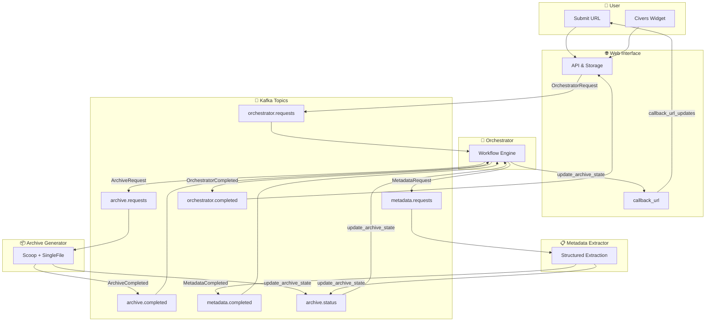

# CIVERS - Citation of Versioned Web Pages by PID

A comprehensive system for archiving web pages, extracting metadata, and managing digital artifacts. CIVERS integrates web archiving (WACZ), metadata extraction, and storage into a unified workflow.

[](https://opensource.org/licenses/Apache-2.0)

> [!IMPORTANT]
> **Project Status: Under Active Development**
> CIVERS is currently in an early development phase. Features and APIs are subject to change as the system undergoes active refinement.

> [!TIP]
> **Looking for detailed setup, execution, and debugging instructions?**
> Refer to our comprehensive [DEVELOPMENT.md](DEVELOPMENT.md) guide.

## Components

| Component | Description |
|-----------|-------------|
| **Orchestrator** | Coordinates workflow and manages requests |
| **Archive Generator** | Creates WACZ archives, screenshots, and HTML snapshots |
| **Metadata Extractor** | Extracts structured metadata from archived pages |
| **Web Interface** | Provides storage and access to archived artifacts |

---

## How It Works

CIVERS uses an event-driven architecture with Apache Kafka for inter-service communication:



### Event Flow (Standard Workflow)

| Step | Event | Producer → Consumer |
|------|-------|---------------------|
| 1 | `OrchestratorRequestEvent` | Web Interface → Orchestrator |
| 2 | `ArchiveRequestEvent` | Orchestrator → Archive Generator |
| 3 | `ArchiveCompletedEvent` | Archive Generator → Orchestrator |
| 4 | `MetadataExtractionRequestEvent` | Orchestrator → Metadata Extractor |
| 5 | `MetadataExtractionCompletedEvent` | Metadata Extractor → Orchestrator |
| 6 | `OrchestratorCompletedEvent` | Orchestrator → Web Interface |

### Status Updates & Callbacks

- **Status Events**: Each component emits status events (e.g., `ArchiveStatusEvent`) during processing
- **Callback URL**: The Web Interface provides a `callback_url` in the initial request; the Orchestrator sends final status updates (success/failure) to this URL
- **Real-time Updates**: Users can poll the Web Interface API or use the callback to get notified when archiving completes

---

## Architecture

### Component Responsibilities

| Component | Responsibility |
|-----------|---------------|
| **Web Interface** | REST API, file storage, archive replay (ReplayWeb.page), SQLite database |
| **Orchestrator** | Workflow routing, domain matching, request coordination |
| **Archive Generator** | Web crawling via [Scoop](https://github.com/harvard-lil/scoop), HTML snapshots via SingleFile |
| **Metadata Extractor** | JSON-LD extraction, DataCite schema mapping |

### Generated Artifacts

| Artifact | Description |
|----------|-------------|
| `archive.wacz` | Web archive for replay (WARC + indexes) |
| `screenshot.png` | Full-page screenshot |
| `singlefile.html` | Self-contained HTML snapshot |
| `dom-snapshot.html` | Raw DOM snapshot |
| `metadata.json` | Extracted metadata (DataCite format) |

---

## Quick Start

### Prerequisites

- Docker 24.0+ with Docker Compose 2.0+
- Python 3.10+ with [uv](https://astral.sh/uv) package manager (for scripts)

### Start Development Stack

```bash
# Clone the repository
git clone https://github.com/dainst/civers.git
cd civers

# Start services (hot-reload enabled), optional ENV variable is to setup the environment defined in configs/environments default is docker environment
make dev [ENV=docker|test|development ...]

# Verify all services are running
make ps
```

### Access Points

| URL | Description |
|-----|-------------|
| <http://localhost:8000> | Web Interface (browse archives) |
| <http://localhost:8000/docs> | API documentation |
| <http://localhost:8000/replay/{id}> | Replay a snapshot |

### Run Test

```bash
uv run python scripts/full_stack_test.py --test-url "https://arachne.test.dainst.org/entity/1152914"
```

---

## Deployment Guide

### Deployment Options

| Method                | Use Case              | Command    |
| :-------------------- | :-------------------- | :--------- |
| **Local Development** | Hot-reload, debugging | `make dev` |

### Option 1: Local Development

Best for active development with hot-reload:

```bash
make dev
make logs         # Follow logs
make dev ENV=test # Start with 'test' configuration
```

Switching environments allows you to test different settings (like Kafka brokers, storage paths, or log levels) without modifying the code.

---

---

## Docker Compose Files

CIVERS uses Docker Compose file layering for different environments:

| File | Purpose |
|------|---------|
| `docker-compose.yml` | Base configuration with all service definitions |
| `docker-compose.dev.yml` | Development overrides (standalone, volume mounts, host network) |
| `docker-compose.test.yml` | Test server overrides (Traefik SSL, external network) |

### Compose Override Pattern

Docker Compose merges files in order, with later files overriding earlier ones:

```bash
# Development (standalone)
docker compose -f docker-compose.yml -f docker-compose.dev.yml up -d

# Test server (base + test overrides)
docker compose -f docker-compose.yml -f docker-compose.test.yml up -d
```

---

## Makefile Reference

| Target | Description |
|--------|-------------|
| `make dev` | Start development stack with hot-reload |
| `make logs` | Follow development logs |
| `make restart-dev` | Restart application services (not Kafka) |
| `make stop` | Stop all containers |
| `make ps` | Show status of all stacks |
| `make network` | Create Docker network (run once per server) |
| `make test-deploy` | Build and deploy to test server |

Run `make help` for full list.

---

## Configuration Reference

Configuration files are in `configs/`:

```
configs/
├── defaults/           # Default configuration
│   ├── app.yaml       # Core application settings
│   ├── kafka.yaml     # Kafka transport settings
│   ├── storage.yaml   # Storage backend settings
│   ├── domains.yaml   # Domain-specific rules
│   ├── workflows.yaml # Workflow definitions
│   └── web_interface.yaml
└── environments/       # Environment overrides
    ├── development.yaml
    ├── docker.yaml
    └── test.yaml
```

### Environment Selection

CIVERS uses the `CONFIG_ENVIRONMENT` variable to choose which override file to load from `configs/environments/`.

1. **Hierarchy**: Settings in `defaults/` are loaded first, then overwritten by the selected `environments/{env}.yaml` file.
2. **Detection**:
   - Explicit: `CONFIG_ENVIRONMENT=xxx`
   - Docker: Auto-detects `docker` environment
   - Testing: Auto-detects `testing` during pytest
   - Default: Falls back to `development`
3. **Usage**:
   - **Local**: `make dev ENV=docker` (default)
   - **Test Server**: `docker-compose.test.yml` sets `CONFIG_ENVIRONMENT=test`

### Core Settings (app.yaml)

```yaml
app:
  scoop_timeout_sec: 300      # Max time for Scoop archive
  singlefile_timeout_sec: 20  # Max time for SingleFile
  archive_directory: "archives"
```

### Workflow Configuration (workflows.yaml)

Defines multi-step processing pipelines:

```yaml
- name: "standard_archive_workflow"
  steps:
    - name: "archive_generation"
      component: "archive_generator"
    - name: "metadata_extraction"
      component: "metadata_extractor"
      depends_on: ["archive_generation"]
```

### Domain Configuration (domains.yaml)

Domain-specific archiving rules and JSON-LD metadata mappings:

```yaml
- domain: "arachne.test.dainst.org"
  artifacts: [warc, html, screenshots, singlefile, json]
  workflow: "archaeology_workflow"
  mappings: &arachne_mappings_test
    "name": "Title.title"
    "description": "Description.description|description_type=Abstract"
    "@id": "AlternateIdentifier.alternate_identifier"
    "author[*].name": "Creator[*].creator_name|name_type=Organizational"
    # ... see configs/defaults/domains.yaml for full list
```

### Environment Variables

Key environment variables for deployment:

| Variable | Default | Description |
|----------|---------|-------------|
| `CONFIG_ENVIRONMENT` | `development` | Config environment to load |
| `KAFKA_BOOTSTRAP_SERVERS` | `localhost:29092` | Kafka broker address |
| `ARCHIVE_DIRECTORY` | `archives` | Local archive storage path |

---

## Scripts Reference

Utility scripts in `scripts/`:

| Script | Purpose |
|--------|---------|
| `full_stack_test.py` | End-to-end integration test |
| `kafka_flow_monitor.py` | Real-time Kafka message monitoring |
| `verify_storage.py` | Verify storage backend connectivity |

### Usage Examples

```bash
# Run integration test
uv run python scripts/full_stack_test.py --test-url "https://arachne.test.dainst.org/entity/1152914" --timeout 180

# Monitor Kafka events in real-time
uv run python scripts/kafka_flow_monitor.py

# Verbose mode (show raw JSON)
VERBOSE=true uv run python scripts/kafka_flow_monitor.py
```

---

## Project Structure

```
civers/
├── civers_orchestrator/          # Workflow coordination
├── civers_archive_generator/     # Web archiving (Scoop + SingleFile)
├── civers_metadata_extractor/    # Metadata extraction
├── civers_archive_web_interface/ # Storage and Web UI
├── configs/
│   ├── defaults/                # Default configuration files
│   └── environments/            # Environment-specific overrides
├── scripts/                     # Utility scripts
├── docker-compose.yml           # Base Docker Compose
├── docker-compose.dev.yml       # Development overrides
├── docker-compose.test.yml      # Test server overrides
└── Makefile                     # Build automation
```

---

## Monorepo Management

This project uses **Git Subtree** to maintain a unified codebase while syncing with standalone repositories.

### Setup Remotes (Maintainers Only)

```bash
git remote add remote-archive-generator git@github.com:dainst/civers_archive_generator.git
git remote add remote-web-interface git@github.com:dainst/civers_archive_web_interface.git
git remote add remote-metadata-extractor git@github.com:dainst/civers_metadata_extractor.git
git remote add remote-orchestrator git@github.com:dainst/civers_orchestrator.git
```

### Sync Commands

```bash
# Push changes to standalone repo
git subtree push --prefix=civers_archive_generator remote-archive-generator main

# Pull changes from standalone repo
git fetch remote-archive-generator
git subtree pull --prefix=civers_archive_generator remote-archive-generator main --squash
```

---

## Troubleshooting

### Common Issues

| Issue | Solution |
| :--- | :--- |
| Services won't start | Check `make logs`, ensure Docker is running |
| Kafka connection errors | Wait for Kafka to initialize (~30s) |
| Archive timeout | Increase `scoop_timeout_sec` in `app.yaml` |
| ReplayWeb.page requires HTTPS | Use `docker-compose.test.yml` with Traefik |

---

## License & Credits

### License

This project is licensed under the **Apache License 2.0** - see the [LICENSE](LICENSE) file for details.

### Third-Party Tools

CIVERS integrates the following open-source tools:

| Tool | License | Purpose |
|------|---------|---------|
| [Scoop](https://github.com/harvard-lil/scoop) | MIT | Web archiving (Harvard Library Innovation Lab) |
| [SingleFile](https://github.com/nicholasaleks/single-file-cli) | AGPL-3.0 | Self-contained HTML snapshots |
| [ReplayWeb.page](https://replayweb.page/) | AGPL-3.0 | WACZ archive replay |
| [Apache Kafka](https://kafka.apache.org/) | Apache-2.0 | Message streaming |

---
