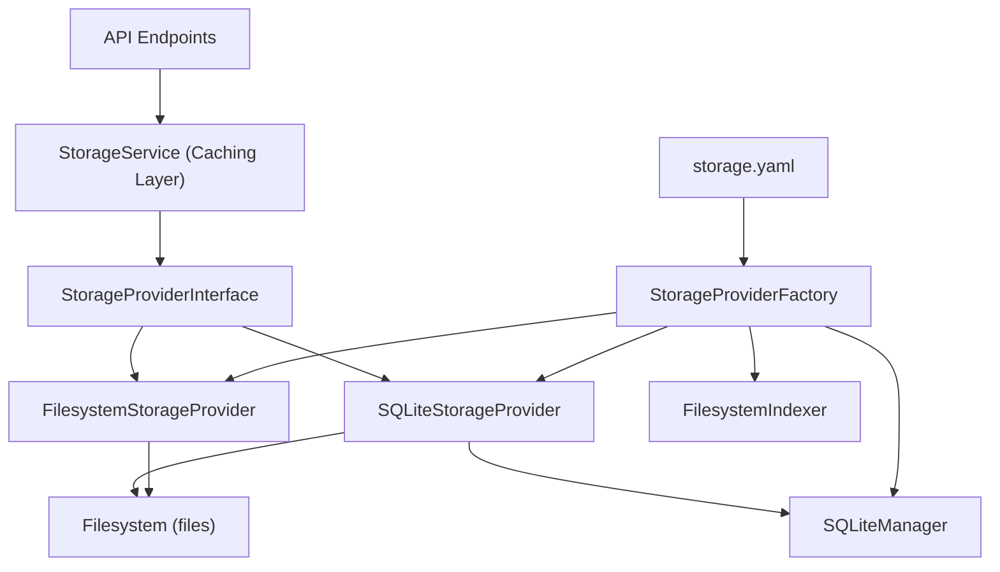

# Storage Architecture Documentation

## Overview

The storage system handles archived web content using a provider pattern. This lets you switch between different storage backends (filesystem, SQLite) without changing the API code. It includes caching for better performance and integrates cleanly with FastAPI.

**What it does**: Manages archived URLs, snapshots, and artifacts with caching and provider switching

**How it works**: Acts as the interface between API endpoints and storage backends

## Files

```
app/storage/
├── service.py                        - Main service with caching
├── factory.py                        - Creates providers and services
└── providers/
    ├── storage_provider_interface.py  - Interface for all providers
    ├── filesystem.py                 - Filesystem implementation
    └── sqlite_storage.py             - SQLite implementation

app/database/
├── sqlite_manager.py                 - SQLite connection and query management
├── models.py                         - Database schema definitions
└── indexer.py                        - Filesystem-to-database indexer
```

## Architecture



## Main Components

### StorageProviderInterface (storage_provider_interface.py)

**The interface that all storage providers must implement.**

```python
class StorageProviderInterface(ABC):
    @abstractmethod
    def get_all_urls(self) -> Dict[str, ArchivedUrl]: ...

    @abstractmethod
    def get_url_by_id(self, url_id: str) -> Optional[ArchivedUrl]: ...

    @abstractmethod
    def get_snapshot_by_id(self, snapshot_id: str) -> Optional[Snapshot]: ...

    @abstractmethod
    def get_artifact_stream(self, snapshot_id: str, artifact_type: str) -> Optional[IO]: ...

    @abstractmethod
    def artifact_exists(self, snapshot_id: str, artifact_type: str) -> bool: ...

    @abstractmethod
    def get_artifact_path(self, snapshot_id: str, artifact_type: str) -> Optional[Path]: ...

    @abstractmethod
    def create_snapshot(
        self, url: str, request_id: str, files: Dict[str, IO], allow_existing: bool = False
    ) -> Snapshot: ...
```

**Exception hierarchy:**

```
StorageError (base)
├── StorageTimeoutError (operation timeouts)
└── StoragePermissionError (access denied)
```

---

### FilesystemStorageProvider (filesystem.py)

**Reads archives by scanning local directories. Simple, no database required.**

```python
class FilesystemStorageProvider(StorageProviderInterface):
    def __init__(self, storage_path: Path, validation_config: ValidationConfig, timeout_seconds: int = 10):
        self.storage_path = Path(storage_path)
        self.timeout_seconds = timeout_seconds
        self.validation_config = validation_config
```

**What it does:**

- Scans directory structure: `archives/{domain}/{path_segment}/req_{request-id}_{timestamp}/`
- Parses JSON metadata files for snapshot details
- Has timeout protection for large directory scans
- Finds available artifacts (WACZ files, screenshots, etc.)
- Creates snapshots by writing files to structured directories

**Use when:** Developing locally, working with small archives, or you want simplicity.

---

### SQLiteStorageProvider (sqlite_storage.py)

**Uses SQLite database index for fast queries while storing actual files on filesystem.**

```python
class SQLiteStorageProvider(StorageProviderInterface):
    def __init__(self, db_manager: SQLiteManager, storage_path: Path, validation_config: ValidationConfig):
        self.db_manager = db_manager
        self.storage_path = Path(storage_path)
        self.validation_config = validation_config
```

**What it does:**

- Queries SQLite database for URL and snapshot lookups (fast indexed queries)
- Stores actual files on filesystem using shared utilities
- Builds index from filesystem on startup via `FilesystemIndexer`
- Supports idempotent snapshot creation (add files to existing snapshots)
- Completely separate implementation from `FilesystemStorageProvider` — not a wrapper

**Key difference from filesystem provider:**

| Operation | Filesystem | SQLite |
|-----------|-----------|--------|
| `get_all_urls()` | Scans directories on every call | 3 flat SQL queries + Python assembly |
| `get_snapshot_by_id()` | Scans all directories until found | Indexed lookup by ID |
| `create_snapshot()` | Writes files + returns result | Writes files + inserts DB records |
| `artifact_exists()` | Checks filesystem path | Queries artifacts table |

**Use when:** Running in production, working with larger archives, or you need fast query performance.

**Supporting components:**

- **`SQLiteManager`** (`app/database/sqlite_manager.py`): Manages SQLite connections, executes queries, handles schema initialization
- **`FilesystemIndexer`** (`app/database/indexer.py`): Scans filesystem and builds the SQLite index; `fs_provider` is optional (`None` by default, required only for `rebuild_index()`)
- **Database schema** (`app/database/models.py`): Defines `urls`, `snapshots`, `artifacts` tables with indexes on timestamps and IDs

---

### StorageService (service.py)

**The main interface that adds caching and business logic on top of storage providers.**

```python
class StorageService:
    def __init__(self, provider: StorageProviderInterface, cache_ttl_seconds: int = 60):
        self.provider = provider
        self.cache_ttl_seconds = cache_ttl_seconds
        self._cached_urls: Optional[Dict[str, ArchivedUrl]] = None
        self._cache_timestamp = 0.0
        self._cache_lock = threading.Lock()  # Thread-safe cache access
```

**Methods:**

| Method | Description |
|--------|-------------|
| `get_all_urls()` | All URLs with cache |
| `get_url_by_id(url_id)` | Specific URL from cache |
| `find_url_by_original_url(url)` | Normalized URL lookup (strips query params + trailing slashes) |
| `get_snapshot_by_id(snapshot_id)` | Direct provider call |
| `get_snapshots_for_url(url_id)` | All snapshots for a URL |
| `get_artifact_stream(snapshot_id, artifact_type)` | File download stream (caller must close) |
| `artifact_exists(snapshot_id, artifact_type)` | Check artifact availability |
| `get_artifact_path(snapshot_id, artifact_type)` | Filesystem path to artifact |
| `create_snapshot(url, request_id, files, ...)` | Create snapshot + invalidate cache |
| `clear_cache()` | Manual cache invalidation |
| `get_cache_stats()` | Cache monitoring info |
| `get_db_manager()` | Get underlying DB manager if provider supports it (or `None`) |

---

### StorageProviderFactory (factory.py)

**Creates providers and services based on configuration.**

```python
def create_storage_provider(app_config: AppConfig) -> StorageProviderInterface:
    config = app_config.storage
    if config.type == 'filesystem':
        return _create_filesystem_provider(config, app_config.validation)
    elif config.type == 'sqlite':
        return _create_sqlite_provider(config, app_config.validation)
```

**SQLite provider creation flow:**

1. Resolve filesystem and database paths
2. Create `SQLiteManager` and connect
3. Initialize database schema
4. **Conditional rebuild:** Check if the `urls` table is empty
   - If empty: Create temporary `FilesystemStorageProvider`, run `FilesystemIndexer.rebuild_index()` to populate database
   - If populated: Skip rebuild entirely (fast startup for existing installations)
5. Return `SQLiteStorageProvider` with populated database

## Design Patterns

### 1. Provider Pattern

- **Interface**: `StorageProviderInterface` defines 7 abstract methods
- **Implementations**: `FilesystemStorageProvider`, `SQLiteStorageProvider`
- **Benefits**: Easy to switch backends, test with mocks, add new storage types

### 2. Service Layer

- **Service**: `StorageService` adds caching and business logic
- **Purpose**: Hides provider complexity from API endpoints
- **Handles**: Caching, cache invalidation on writes, error handling

### 3. Factory Pattern

- **Factory**: Creates providers and services based on YAML configuration
- **Benefits**: Centralized creation logic, handles SQLite initialization complexity
- **Integration**: Works with FastAPI app state

## FastAPI Integration

**Setup at startup:**

```python
@asynccontextmanager
async def lifespan(app: FastAPI):
    # Load configuration
    app_config = load_app_config()
    app.state.app_config = app_config

    # Create storage service (type determined by storage.yaml)
    storage_service = create_storage_service(app_config)
    app.state.storage_service = storage_service
```

**Use in API endpoints:**

```python
@router.get("/api/urls")
async def list_urls(request: Request):
    storage_service = request.app.state.storage_service
    all_urls = storage_service.get_all_urls()  # cached
```

## Caching

**How caching works:**

- **Single cache layer**: Only the `StorageService` maintains a cache. Storage providers do not cache internally — each call to a provider's `get_all_urls()` returns fresh data
- **TTL**: Configurable in `storage.yaml` → `storage.cache.ttl_seconds` (default: 60)
- **Invalidation**: Expires based on time; also invalidated on `create_snapshot()`
- **Thread safety**: All cache reads and writes are protected by `threading.Lock` to prevent data races in multi-threaded environments (e.g., FastAPI with multiple workers)

```python
def _is_cache_expired(self) -> bool:
    if self.cache_ttl_seconds <= 0:
        return True  # Caching disabled
    return time.time() - self._cache_timestamp > self.cache_ttl_seconds
```

## Configuration

Storage is configured via `configs/data/defaults/storage.yaml`:

```yaml
# Filesystem provider
storage:
  type: "filesystem"
  filesystem:
    path: "archives"
    timeout_seconds: 10
  cache:
    ttl_seconds: 60

# SQLite provider
storage:
  type: "sqlite"
  sqlite:
    db_path: "data/archives.db"
    auto_rebuild: true
    connection_timeout: 10
  filesystem:
    path: "archives"   # Still needed for file storage
  cache:
    ttl_seconds: 60
```

Both providers require `filesystem.path` — the SQLite provider stores files on disk just like the filesystem provider, but uses the database for fast indexed queries.

## Error Handling

**Exception hierarchy:**

```text
StorageError (base, from provider operations)
├── StorageTimeoutError (operation timeouts)
└── StoragePermissionError (access denied)

StorageConfigurationError (from factory, not a subclass of StorageError)
```

**How errors flow through the layers:**

- **Factory Level**: Raises `StorageConfigurationError` for config issues. Re-raises it directly without double-wrapping
- **Provider Level**: Catches filesystem/database errors, wraps in `StorageError`
- **Service Level**: Adds context and logging. `get_artifact_stream()` returns a stream that the **caller is responsible for closing**
- **API Level**: Converts to HTTP error responses
- **Graceful Degradation**: Continue when possible on partial failures

## Adding New Storage Providers

**Step 1: Implement the interface**

```python
class S3StorageProvider(StorageProviderInterface):
    def __init__(self, bucket: str, region: str):
        # S3 client setup

    def get_all_urls(self) -> Dict[str, ArchivedUrl]:
        # S3 bucket scanning logic

    # ... implement all 7 abstract methods
```

**Step 2: Update the factory**

```python
def create_storage_provider(app_config: AppConfig) -> StorageProviderInterface:
    config = app_config.storage
    if config.type == 'filesystem':
        return _create_filesystem_provider(config, app_config.validation)
    elif config.type == 'sqlite':
        return _create_sqlite_provider(config, app_config.validation)
    elif config.type == 's3':
        return _create_s3_provider(config)
```

**Step 3: Add config model** in `configs/models.py`:

```python
class S3Config(BaseModel):
    bucket: str
    region: str = "eu-central-1"
```

## Summary

The storage system has a clean, layered design:

1. **Provider Layer**: Pluggable backend implementations (Filesystem, SQLite)
2. **Service Layer**: Business logic, caching, and cache invalidation
3. **Factory Layer**: Configuration-driven creation with SQLite auto-indexing
4. **Integration Layer**: FastAPI app state injection

The design focuses on performance through caching and database indexing, maintainability through clean abstractions, and extensibility through the provider pattern.
