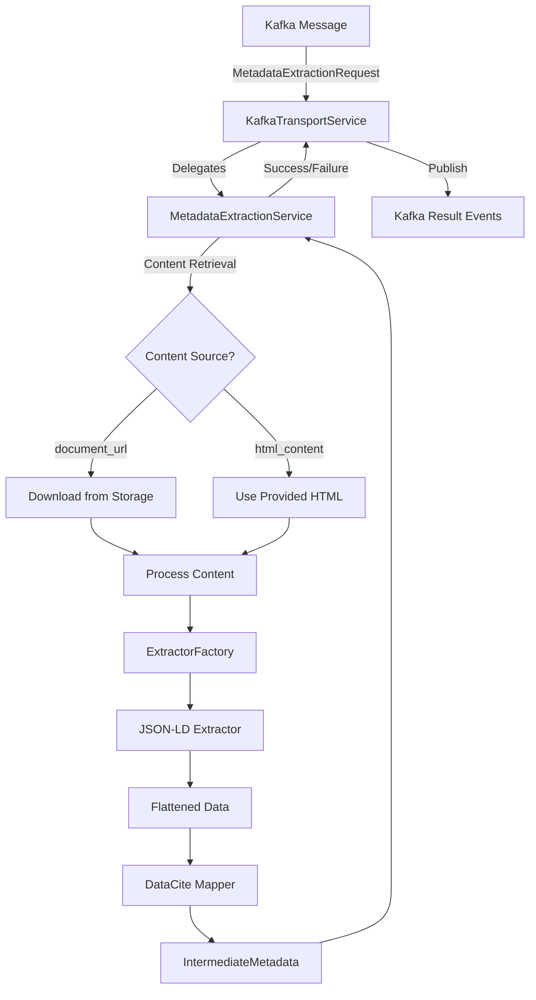

# CIVERS Metadata Extractor

A Python service that extracts metadata from web resources and converts it to DataCite format. Uses Kafka for message processing.

[](tests/)
[](https://www.python.org/downloads/)
[](LICENSE)

## 🚀 Quick Start (5 Minutes)

### Prerequisites

- **Python 3.12+**
- **Docker & Docker Compose** - For Kafka
- **UV** - Python package manager ([Install Guide](https://docs.astral.sh/uv/getting-started/installation/))

### Setup

```bash
# 1. Clone the repository
git clone https://github.com/dainst/civers-metadata-extractor.git
cd civers-metadata-extractor

# 2. Install dependencies
uv sync

# 3. Configure the system
cp app_config.yaml.example app_config.yaml

# 4. Start Kafka infrastructure
./scripts/setup_kafka.sh

# 5. Start the service
uv run python main.py
```

Expected output:

```
INFO - CIVERS Metadata Extraction Service starting up
INFO - Loading configuration from app_config.yaml
INFO - JSON-LD extractor registered successfully
INFO - Connected to Kafka: localhost:29092
INFO - Service ready - listening for extraction requests
```

### Test It

**Option 1: Default Mode (Embedded HTML Content)**

```bash
# Run the demo with embedded HTML
uv run python scripts/simple_demo.py
```

**Option 2: Document URL Mode (Download from Storage)**

```bash
# Run the demo with document_url
uv run python scripts/simple_demo.py --document-url "http://127.0.0.1:8000/api/artifacts/serve?snapshot_id=req_123456_20251204_163237&type=document.html"
```

**View All Options**

```bash
# See help for all available options
uv run python scripts/simple_demo.py --help
```

Expected output:

```
🎯 CIVERS Metadata Extractor - Simple Demo
Arachne Archaeological Database Sample
==================================================
📥 Mode: Download HTML from document_url
   URL: http://127.0.0.1:8000/api/artifacts/serve?snapshot_id=req_123456_20251204_163237&type=document.html

🚀 Initializing Simple Metadata Extraction Demo...
📤 Sent extraction request (mode: html_content or document_url)
   Request ID: demo_aa2dc2ac_1733652033
   URL: https://arachne.dainst.org/entity/1079332
   Domain: arachne.dainst.org

🔍 Monitoring extraction...
✅ Extraction completed!

📊 EXTRACTION RESULTS
==================================================
Status: COMPLETED
Processing Time: 0.14 seconds
Domain Used: arachne.dainst.org
Mappers Used: flattened_to_intermediate
📄 JSON Output: output/metadata/metadata_arachne_dainst_org_demo_aa2dc2ac_1733652033.json

📋 METADATA PREVIEW:
   datacite_model: {...}
   model_validation: {'is_valid': True, ...}

📁 Metadata saved to: demo_output/arachne_metadata_aa2dc2ac.json
```

---

## ✨ Features

### What It Does

- **JSON-LD Extraction** - Extracts structured data from web pages
- **DataCite Conversion** - Converts to DataCite 4.6 format
- **Kafka Integration** - Processes messages asynchronously
- **Flexible Content Sources** - Accepts HTML from different sources
- **YAML Configuration** - Domain-specific mapping rules

### Content Sources

The service requires ONE of two content sources:

**1. Download from Storage Service**

```json
{
  "request_id": "req-001",
  "url": "https://example.com/artifact/123",
  "document_url": "https://storage.example.com/documents/123.html"
}
```

→ Service downloads HTML from `document_url`

**2. Provide HTML Directly**

```json
{
  "request_id": "req-002",
  "url": "https://example.com/artifact/456",
  "html_content": "<html>...</html>"
}
```

→ Service uses provided HTML  
→ No additional dependencies needed

**Note**: Requests without `document_url` or `html_content` will be rejected.

---

## 🏗️ Architecture

### Clean Two-Layer Architecture

```
┌─────────────────────────────────────────────────────────┐
│                 Transport Layer (Kafka)                 │
│  • Receives Kafka messages                              │
│  • Parses request events                                │
│  • Delegates to service layer                           │
│  • Publishes success/failure events                     │
│  • AGNOSTIC about extraction implementation             │
└─────────────────────────────────────────────────────────┘
                         │
                         │ Delegates
                         ▼
┌─────────────────────────────────────────────────────────┐
│            Service Layer (Business Logic)               │
│  • Handles ALL content retrieval (document_url, etc)    │
│  • Downloads HTML when needed                           │
│  • Validates URLs and domains                           │
│  • Extracts metadata using extractors/mappers          │
│  • Generates JSON output files                          │
│  • Returns structured results                           │
└─────────────────────────────────────────────────────────┘
```

### Component Overview



### Separation of Concerns

**Transport Layer** (KafkaTransportService):

- ✅ Receives and parses Kafka messages
- ✅ Delegates to service layer
- ✅ Publishes result events
- ❌ **NO** business logic
- ❌ **NO** content retrieval
- ❌ **NO** HTTP operations

**Service Layer** (MetadataExtractionService):

- ✅ Handles ALL content retrieval logic
- ✅ Downloads from document_url, html_content, or URL
- ✅ Validates URLs and domains
- ✅ Coordinates extraction and mapping
- ❌ **NO** Kafka knowledge
- ❌ **NO** transport concerns

> **Key Principle**: The transport layer is agnostic about HOW extraction happens. It only handles messaging.

---

## 📖 Usage

### Method 1: Kafka Event Processing (Recommended for Production)

The service automatically processes Kafka messages:

```python
# Send extraction request via Kafka
from kafka import KafkaProducer
import json

producer = KafkaProducer(
    bootstrap_servers=['localhost:29092'],
    value_serializer=lambda x: json.dumps(x).encode('utf-8')
)

# With document_url (storage service)
request = {
    "request_id": "req-001",
    "url": "https://arachne.dainst.org/entity/123",
    "document_url": "https://storage.example.com/artifacts/123.html"
}

producer.send('metadata.extraction.requests', value=request)
```

The service will:

1. Download HTML from `document_url`
2. Extract JSON-LD metadata
3. Map to DataCite format
4. Publish completion event to `metadata.extraction.completed`

### Method 2: Direct API Usage

```python
from metadata_extraction_services.metadata_extraction_service import MetadataExtractionService
from configs.models import ConfigDataModel

# Initialize service
config = ConfigDataModel.from_yaml("app_config.yaml")
service = MetadataExtractionService(config)

# Extract metadata
result = await service.extract_metadata(
    url="https://arachne.dainst.org/entity/123",
    request_id="req-001",
    document_url="https://storage.example.com/artifacts/123.html"  # Optional
)

if result.success:
    print(f"✅ Extracted: {result.intermediate_metadata}")
    print(f"⏱️  Processing time: {result.processing_time_seconds}s")
else:
    print(f"❌ Error: {result.error_message}")
```

### Method 3: Component-Level Usage

```python
from metadata_extractors.extractors.jsonld_extractor import JsonLDExtractor
from metadata_extractors.mappers.flattened_to_intermediate_mapper import FlattenedToIntermediateModelMapper

# Extract JSON-LD
extractor = JsonLDExtractor()
extraction_result = extractor.extract(html_content, source_url)

# Map to DataCite
mapper = FlattenedToIntermediateModelMapper()
mapping_result = mapper.map_to_intermediate(
    extraction_result.raw_data,
    domain_config,
    source_url
)

print(f"📊 Extracted {extraction_result.metadata_count} fields")
print(f"🎯 Mapped {mapping_result.mapped_fields_count} to DataCite")
```

---

## ⚙️ Configuration

### Domain Configuration

Create domain-specific configurations in YAML:

```yaml
# configs/domains/archaeology.yaml
name: "arachne.dainst.org"
input_source: "html_document"
mapper:
  type: "flattened_to_intermediate"
  mappings:
    # Simple field mapping
    "headline": "Title.title"
    
    # Nested field mapping
    "author.name": "Creator.creator_name"
    "publisher.name": "Publisher.publisher"
    
    # Date mapping
    "datePublished": "Date.date"
    
    # Array mapping with [*] pattern
    "keywords[*]": "Subject.subject"
    
    # Complex nested arrays
    "contributors[*].person.name": "Contributor.contributor_name"
```

### Application Configuration

```yaml
# app_config.yaml
app:
  name: "CIVERS Metadata Extractor"
  version: "2.0.0"
  
  transport:
    kafka:
      bootstrap_servers: "localhost:29092"
      consumer_group: "metadata_extraction_group"
      topics:
        metadata_extraction_requests: "metadata.extraction.requests"
        metadata_extraction_completed: "metadata.extraction.completed"
        metadata_extraction_failed: "metadata.extraction.failed"
  
  domains:
    - name: "arachne.dainst.org"
      config_file: "configs/domains/arachne.yaml"
```

---

## 🔍 JSON-LD Processing

### Supported Structures

```javascript
// Simple object
{
  "@context": "https://schema.org",
  "@type": "Article",
  "headline": "Roman Archaeology Study",
  "author": {"name": "Dr. Smith"},
  "datePublished": "2023-06-15"
}

// Complex nested arrays
{
  "@context": "https://schema.org",
  "@type": "Dataset",
  "name": "Archaeological Survey",
  "author": [
    {"@type": "Person", "name": "Dr. Smith"},
    {"@type": "Person", "name": "Dr. Jones"}
  ],
  "keywords": ["archaeology", "Roman", "survey"]
}
```

### Extraction Process

1. **Find JSON-LD scripts** - Locates `<script type="application/ld+json">` tags
2. **Parse JSON** - Validates and parses JSON structure
3. **Flatten hierarchy** - Converts nested structures to dot notation (`author.name`)
4. **Index arrays** - Creates indexed keys for array items (`author[0].name`, `author[1].name`)
5. **Return flattened data** - Provides flat key-value pairs for mapping

### Mapping to DataCite

The mapper uses configuration rules to convert flattened JSON-LD to DataCite format:

```yaml
# Input: Flattened JSON-LD
{
  "headline": "Archaeological Discovery",
  "author[0].name": "Dr. Smith",
  "author[1].name": "Dr. Jones",
  "keywords[0]": "archaeology",
  "keywords[1]": "Roman"
}

# Mapping Rules
mappings:
  "headline": "Title.title"
  "author[*].name": "Creator.creator_name"
  "keywords[*]": "Subject.subject"

# Output: DataCite Metadata
{
  "titles": [{"title": "Archaeological Discovery"}],
  "creators": [
    {"creatorName": "Dr. Smith"},
    {"creatorName": "Dr. Jones"}
  ],
  "subjects": [
    {"subject": "archaeology"},
    {"subject": "Roman"}
  ]
}
```

---

## 🧪 Testing

### Run Tests

```bash
# All tests
uv run pytest tests/ -v

# Specific component tests
uv run pytest tests/test_metadata_extractor/ -v
uv run pytest tests/transport_services/ -v

# With coverage
uv run pytest tests/ --cov --cov-report=html
```

### Test Status

**All 134 tests passing** ✅

| Component | Tests | Status |
|-----------|-------|--------|
| JSON-LD Extractor | 12 | ✅ 100% |
| Mappers | 15 | ✅ 100% |
| HTML Parser | 8 | ✅ 100% |
| Factory | 6 | ✅ 100% |
| Transport Services | 36 | ✅ 100% |
| Service Layer | 57 | ✅ 100% |

---

## 📁 Project Structure

```
civers_metadata_extractor/
├── main.py                              # Application entry point
├── configs/                             # Configuration system
│   ├── models.py                       # Configuration models
│   ├── domains/                        # Domain-specific configs
│   └── app_config.yaml                 # Main application config
├── metadata_extraction_services/        # Service layer (business logic)
│   ├── metadata_extraction_service.py  # Main service orchestrator
│   ├── metadata_extraction_service_interface.py  # Service contract
│   ├── url_validator.py                # URL validation
│   └── extraction_result.py            # Result models
├── metadata_extractors/                 # Extraction components
│   ├── extractors/
│   │   └── jsonld_extractor.py         # JSON-LD extraction
│   ├── mappers/
│   │   └── flattened_to_intermediate_mapper.py  # DataCite mapping
│   └── extractor_factory.py            # Factory for creating extractors
├── transport_services/                  # Transport layer (messaging)
│   └── kafka/
│       ├── kafka_transport_service.py  # Main Kafka service
│       ├── kafka_connection_manager.py # Connection handling
│       ├── event_publisher.py          # Event publishing
│       └── event_models.py             # Kafka event models
├── models/                              # DataCite models
│   └── intermediate_metadata.py        # DataCite schema models
├── scripts/                             # Utility scripts
│   ├── simple_demo.py                  # Demo script
│   ├── document_url_example.py         # document_url usage example
│   └── setup_kafka.sh                  # Kafka setup script
└── tests/                               # Test suite
    ├── test_metadata_extractor/        # Extractor tests
    ├── transport_services/              # Transport tests
    └── test_metadata_extraction_services/  # Service tests
```

---

## 🐳 Production Deployment

### Docker

```dockerfile
FROM python:3.12-slim

WORKDIR /app

# Install UV
RUN pip install uv

# Copy application files
COPY . .

# Install dependencies
RUN uv sync

# Run the service
CMD ["uv", "run", "python", "main.py"]
```

### Docker Compose

```yaml
version: '3.8'

services:
  metadata-extractor:
    build: .
    environment:
      - KAFKA_BOOTSTRAP_SERVERS=kafka:9092
      - LOG_LEVEL=INFO
    depends_on:
      - kafka
    volumes:
      - ./app_config.yaml:/app/app_config.yaml
      - ./output:/app/output

  kafka:
    image: confluentinc/cp-kafka:latest
    ports:
      - "29092:29092"
    # ... kafka configuration ...
```

### Environment Variables

```bash
# Kafka Configuration
KAFKA_BOOTSTRAP_SERVERS=localhost:29092

# Logging
LOG_LEVEL=INFO

# Configuration
CONFIG_PATH=/app/configs/app_config.yaml

# Output
OUTPUT_DIR=/app/output/metadata
```

---

## 📊 Monitoring & Observability

### Health Checks

```bash
# Check service health
curl http://localhost:8000/health

# Check Kafka connectivity
uv run python scripts/civers_health_check.py
```

### Metrics

The service tracks:

- ✅ **Processing time** - Per-request extraction duration
- ✅ **Success rate** - Extraction success/failure ratio
- ✅ **Field counts** - Number of fields extracted and mapped
- ✅ **Error types** - Categorized error tracking
- ✅ **Request throughput** - Requests processed per second

### Logging

Comprehensive structured logging:

```python
INFO - 🚀 Processing request req-001: https://example.com/artifact/123
INFO - 📥 Downloading HTML from document_url
INFO - ✅ Successfully downloaded 45231 characters from document URL
INFO - 🔍 Starting metadata extraction for https://example.com/artifact/123
INFO - ✅ Domain configuration found: arachne.dainst.org
INFO - ✅ Request req-001 completed successfully in 0.85s
```

---

## 🔧 Troubleshooting

### Common Issues

**Service won't start**

```bash
# Check Kafka is running
docker ps | grep kafka

# Verify configuration
cat app_config.yaml

# Check Python environment
uv run python -c "import metadata_extractors; print('✅ OK')"
```

**No JSON-LD found**

- Ensure HTML contains `<script type="application/ld+json">` tags
- Validate JSON-LD at [JSON-LD Playground](https://json-ld.org/playground/)
- Check service logs for parsing errors

**HTTP content fetching fails**

```bash
uv sync
uv run python -c "import httpx; print('✅ httpx available')"
```

**Mapping failures**

- Verify domain configuration exists
- Check mapping rules syntax in YAML
- Review logs for specific field errors

---

## 📚 Documentation

- **[Separation of Concerns](SEPARATION_OF_CONCERNS.md)** - Architecture principles
- **[Transport Services](transport_services/README.md)** - Kafka layer documentation
- **[Metadata Services](metadata_extraction_services/README.md)** - Service layer documentation
- **[Tests](tests/README.md)** - Testing guide

---

## 🤝 Contributing

1. Fork the repository
2. Create a feature branch (`git checkout -b feature/amazing-feature`)
3. Write tests for your changes
4. Ensure all tests pass (`uv run pytest tests/ -v`)
5. Commit your changes (`git commit -m 'Add amazing feature'`)
6. Push to the branch (`git push origin feature/amazing-feature`)
7. Open a Pull Request

### Development Setup

```bash
# Clone and setup
git clone <repository-url>
cd civers-metadata-extractor
uv sync

# Install pre-commit hooks
pre-commit install

# Run tests
uv run pytest tests/ -v

# Run linter
uv run ruff check .
```

---

## 📄 License

[Your License Here]

## 💬 Support

- **Issues**: [GitHub Issues](https://github.com/dainst/civers-metadata-extractor/issues)
- **Discussions**: [GitHub Discussions](https://github.com/dainst/civers-metadata-extractor/discussions)
- **Email**: [your-email@example.com]

---

