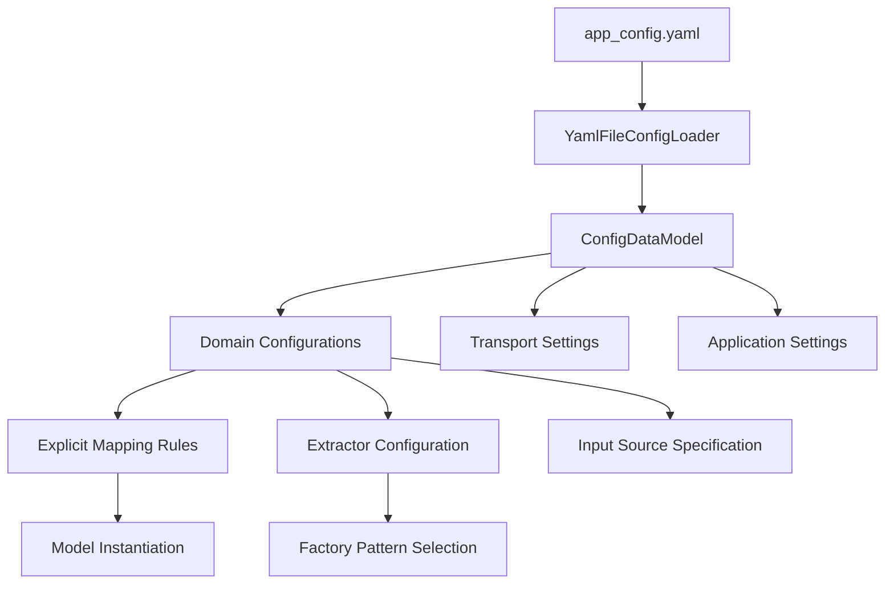

# Configuration System

The configuration system provides YAML-based, domain-specific configuration for metadata extraction with explicit mapping syntax and dynamic array processing capabilities.

## Overview

The configuration system enables flexible, maintainable metadata extraction by separating extraction logic from domain-specific mapping rules. It supports:

- **Domain-Specific Configuration**: Custom extraction rules per website/domain
- **Explicit Mapping Syntax**: `ClassName.property` targeting prevents ambiguity
- **Dynamic Array Mapping**: `[*]` patterns handle unlimited array elements
- **Implicit Value Mapping**: Automatic semantic type inference with `|syntax`
- **JSON-LD Specialization**: Focused configuration for JSON-LD extraction
- **Future Extractor Support**: Planned support for meta tags and CSS selector extraction

## Architecture



## Configuration Files

### Core Files

| File | Purpose | Description |
|------|---------|-------------|
| `app_config.yaml` | Main configuration | Production domain configurations |
| `app_config.yaml.example` | Template | Example configuration with documentation |
| `tests/test_app_config.yaml` | Test config | Development and testing configuration |

### Module Files

| File | Purpose |
|------|---------|
| `yaml_file_loader_config.py` | YAML loading and parsing |
| `models.py` | Pydantic models for configuration validation |
| `logging_config.py` | Logging system configuration |

## Configuration Schema

### Application Settings

```yaml
app:
  name: metadata_extraction_system
  version: 2.0.0
  
  # Transport configuration
  transport:
    enabled: ["kafka"]
    kafka:
      bootstrap_servers: "localhost:29092"
      topics:
        metadata_extraction_requests: "metadata.extraction.requests"
        metadata_extracted: "metadata.extracted"
        # ... additional topics
      consumer_group: "metadata_extraction_group"
      health_check_enabled: true
      monitoring_enabled: true
```

### Domain Configuration

Each domain specifies its input source and mapping strategy:

```yaml
domains:
  - name: example.org
    input_source: html_document    # HTML with embedded structured data
    mapper:
      type: jsonld                 # Extraction type: jsonld, meta_tags, css_selectors
      mappings:
        # Explicit mapping rules with ClassName.property syntax
        "sourceField": "TargetClass.target_property"
```

## Explicit Mapping System

### Understanding the Data Flow: From Structured Data to Flattened Keys

Before diving into mapping configuration, it's essential to understand how extractors process structured data. Extractors (JSON-LD, meta tags, CSS selectors) convert nested structured data into flattened key-value pairs that mappings can target.

#### Example: JSON-LD Extraction Process

**Original JSON-LD Structure:**

```json
{
  "@context": "http://schema.org",
  "@type": "WebPage",
  "name": "Panzerstatue des Augustus von Prima Porta",
  "author": [
    {
      "@type": "Organization",
      "name": "Deutsches Archäologisches Institut",
      "url": "https://www.dainst.org"
    },
    {
      "@type": "Organization", 
      "name": "Universität zu Köln",
      "url": "http://www.portal.uni-koeln.de/"
    }
  ],
  "datePublished": "2024-01-15",
  "spatialCoverage": [
    {
      "name": "Rome",
      "geo": { "latitude": 41.9028, "longitude": 12.4964 }
    }
  ]
}
```

**Flattened Key Structure (What Mappings Target):**

```json
{
  "@context": "http://schema.org",
  "@type": "WebPage", 
  "name": "Panzerstatue des Augustus von Prima Porta",
  "author[0].@type": "Organization",
  "author[0].name": "Deutsches Archäologisches Institut",
  "author[0].url": "https://www.dainst.org",
  "author[1].@type": "Organization",
  "author[1].name": "Universität zu Köln", 
  "author[1].url": "http://www.portal.uni-koeln.de/",
  "datePublished": "2024-01-15",
  "spatialCoverage[0].name": "Rome",
  "spatialCoverage[0].geo.latitude": 41.9028,
  "spatialCoverage[0].geo.longitude": 12.4964
}
```

### Basic Mapping Syntax

The system uses explicit `ClassName.property` syntax to map flattened keys to DataCite model instances:

```yaml
mappings:
  # Map simple fields
  "name": "Title.title"                       # Flattened key → DataCite model.property
  "datePublished": "Date.date"                # Flattened key → DataCite model.property
  
  # Map specific array elements (traditional approach)
  "author[0].name": "Creator.creator_name"     # First author only
  "author[1].name": "Creator.creator_name"     # Second author only
  
  # Map dynamic arrays (modern approach)
  "author[*].name": "Creator.creator_name"     # ALL authors automatically
  "author[*].url": "AlternateIdentifier.alternate_identifier"
  
  # Map nested geographic data  
  "spatialCoverage[*].name": "GeoLocation.geo_location_place"
  "spatialCoverage[*].geo.latitude": "GeoLocation.geo_location_point.point_latitude"
  "spatialCoverage[*].geo.longitude": "GeoLocation.geo_location_point.point_longitude"
```

**Benefits:**

- **Unambiguous**: No confusion about target model or property
- **Self-Validating**: Configuration validates against actual model schemas  
- **IDE Support**: Clear target paths enable editor assistance
- **Extractor Agnostic**: Works with any extractor that produces flattened keys

### Complete Model Class Reference

All available DataCite model classes for mapping targets (from `model_registry.py`):

| Class | Key Properties | Purpose |
|-------|---------------|---------|
| `IntermediateMetadata` | Root container for all metadata | Top-level metadata container |
| `Title` | `title`, `lang`, `title_type` | Resource titles and subtitles |
| `Creator` | `creator_name`, `name_type`, `name_identifier`, `affiliation` | Authors and contributors |
| `Publisher` | `publisher`, `publisher_identifier` | Publishing organizations |
| `Date` | `date`, `date_type` | Temporal information (published, updated, etc.) |
| `Description` | `description`, `description_type`, `lang` | Abstracts, methods, technical info |
| `Subject` | `subject`, `scheme_uri`, `classification_code` | Topics, keywords, classifications |
| `GeoLocation` | `geo_location_place`, `geo_location_point`, `geo_location_box` | Geographic information |
| `GeoLocationPoint` | `point_latitude`, `point_longitude` | Precise geographic coordinates |
| `GeoLocationBox` | `west_bound_longitude`, `east_bound_longitude`, `south_bound_latitude`, `north_bound_latitude` | Geographic bounding box |
| `Identifier` | `identifier`, `identifier_type` | Primary resource identifiers (DOI, Handle) |
| `AlternateIdentifier` | `alternate_identifier`, `alternate_identifier_type` | Secondary identifiers (URLs, ISBNs) |
| `ResourceType` | `resource_type_general`, `resource_type` | Content type classification |
| `Rights` | `rights`, `rights_uri`, `rights_identifier` | License and usage information |
| `Contributor` | `contributor_name`, `contributor_type`, `name_type` | Additional contributors |
| `NameIdentifier` | `name_identifier`, `name_identifier_scheme`, `scheme_uri` | Person/org identifier (ORCID, ROR) |
| `Affiliation` | `affiliation_name`, `affiliation_identifier` | Institutional affiliations |
| `RelatedIdentifier` | `related_identifier`, `related_identifier_type`, `relation_type` | Related resources |
| `FundingReference` | `funder_name`, `funder_identifier`, `award_number` | Funding information |

## Dynamic Array Mapping

### Unlimited Array Processing with `[*]` Patterns

The system supports dynamic array mapping that scales automatically:

```yaml
mappings:
  # Process ALL authors (unlimited)
  "author[*].name": "Creator.creator_name"
  
  # Process ALL images (unlimited)
  "image[*]": "AlternateIdentifier.alternate_identifier"
  
  # Process ALL geographic locations (unlimited)
  "spatialCoverage[*].name": "GeoLocation.geo_location_place"
  "spatialCoverage[*].geo.latitude": "GeoLocation.geo_location_point.point_latitude"
  "spatialCoverage[*].geo.longitude": "GeoLocation.geo_location_point.point_longitude"
```

**Key Benefits:**

- **Unlimited Scalability**: Single pattern handles any number of array elements
- **Zero Configuration Maintenance**: No updates needed for varying data sizes
- **Performance**: Efficient regex-based pattern expansion at runtime
- **Self-Documenting**: Configuration clearly shows intent

### Pattern Expansion Process

```yaml
# Configuration pattern
"author[*].name": "Creator.creator_name"

# Raw data structure
{
  "author[0].name": "Deutsches Archäologisches Institut",
  "author[1].name": "Universität zu Köln", 
  "author[2].name": "Additional Institution"
}

# Runtime expansion to specific rules
{
  "author[0].name": "Creator.creator_name",
  "author[1].name": "Creator.creator_name",
  "author[2].name": "Creator.creator_name"
}

# Model instantiation
[
  Creator(creator_name="Deutsches Archäologisches Institut"),
  Creator(creator_name="Universität zu Köln"),
  Creator(creator_name="Additional Institution")
]
```

## Implicit Value Mapping

### Semantic Type Enhancement with `|` Syntax

Add semantic type information automatically using implicit value syntax:

```yaml
mappings:
  # Explicit semantic mapping
  "datePublished": "Date.date|date_type=Published"
  "author[*].name": "Creator.creator_name|name_type=Organizational"
  "image[*]": "AlternateIdentifier.alternate_identifier|alternate_identifier_type=URL"
  "abstract": "Description.description|description_type=Abstract"
```

### Automatic Type Inference

The system also automatically infers types from field names:

```yaml
mappings:
  "datePublished": "Date.date"     # Automatically infers date_type=Published
  "dateModified": "Date.date"      # Automatically infers date_type=Updated
  "organization_name": "Creator.creator_name"  # Infers name_type=Organizational
```

### Supported Implicit Value Types

| Target Field | Possible Values | Purpose |
|--------------|-----------------|---------|
| `date_type` | `Published`, `Updated`, `Created`, `Issued`, `Accepted`, `Submitted` | DataCite date classification |
| `name_type` | `Organizational`, `Personal` | Creator type classification |
| `description_type` | `Abstract`, `Methods`, `Other`, `TechnicalInfo` | Description classification |
| `alternate_identifier_type` | `URL`, `DOI`, `Handle`, `ISBN` | Identifier type specification |

## Implicit Value Support

The system supports two mechanisms for adding semantic type information: **explicit configuration** and **automatic inference**. This enables DataCite-compliant metadata to be generated with proper type classification.

### Adding Explicit Implicit Values

Configure specific semantic types directly in your domain configuration using the `|` syntax:

```yaml
domains:
  - name: example.org
    mapper:
      type: jsonld
      mappings:
        # Explicit implicit values using | syntax
        "article.dateCreated": "Date.date|date_type=Created"
        "article.dateAccepted": "Date.date|date_type=Accepted" 
        "article.dateSubmitted": "Date.date|date_type=Submitted"
        
        # Organizational vs personal creator types
        "institution[*].name": "Creator.creator_name|name_type=Organizational"
        "person[*].name": "Creator.creator_name|name_type=Personal"
        
        # Description classification
        "methodology": "Description.description|description_type=Methods"
        "technicalNotes": "Description.description|description_type=TechnicalInfo"
        
        # Identifier types (using exact DataCite enum values)
        "doiLink": "AlternateIdentifier.alternate_identifier|alternate_identifier_type=DOI"
        "urlReference": "AlternateIdentifier.alternate_identifier|alternate_identifier_type=URL"
```

### Automatic Inference Mechanism

The system automatically infers semantic types from field names using pattern matching. This happens when **no explicit implicit values** are provided in the mapping configuration.

#### How Automatic Inference Works

**Location**: `explicit_mapping_processor.py:299-372`

The `_infer_implicit_values()` method analyzes source field names to determine appropriate semantic types:

```python
# Automatic inference examples:
"datePublished" → infers date_type=Published
"dateModified"  → infers date_type=Updated  
"dateCreated"   → infers date_type=Created
"organization_name" → infers name_type=Organizational
"author.name"   → infers name_type=Personal (default)
"abstract"      → infers description_type=Abstract
"image[0]"      → infers alternate_identifier_type=URL
```

#### Currently Supported Automatic Inference Rules

**Date Type Inference** (for `Date.date` targets):

- `"publish"` in field name → `DateType.PUBLISHED`
- `"modif"` or `"updat"` in field name → `DateType.UPDATED`  
- `"creat"` in field name → `DateType.CREATED`
- `"issued"` in field name → `DateType.ISSUED`
- `"accept"` in field name → `DateType.ACCEPTED`
- `"submit"` in field name → `DateType.SUBMITTED`

**Creator Name Type Inference** (for `Creator.creator_name` targets):

- Field contains organizational indicators → `NameType.ORGANIZATIONAL`
- Organizational indicators: `organization`, `institution`, `university`, `institute`, `company`, `corp`, `foundation`, `society`, `museum`, `library`
- Otherwise defaults to → `NameType.PERSONAL`

**Description Type Inference** (for `Description.description` targets):

- `"abstract"` in field name → `DescriptionType.ABSTRACT`
- `"citation"` in field name → `DescriptionType.OTHER`  
- `"summary"` in field name → `DescriptionType.ABSTRACT`

**Identifier Type Inference** (for `AlternateIdentifier.alternate_identifier` targets):

- `"url"` in field name or `"http"` in field name → `IdentifierType.URL`
- `"doi"` in field name → `IdentifierType.DOI`
- `"image"` in field name → `IdentifierType.URL`

### Future Enhancement: Dynamic Extension System

**TODO:** The current automatic inference mechanism uses hardcoded pattern matching logic. In a future version, we plan to implement a more dynamic and configurable inference system .

For now, extending the automatic inference requires modifying the `_infer_implicit_values()` method in `explicit_mapping_processor.py:299-372`.

## Real-World Domain Examples

### Arachne (JSON-LD Extraction)

```yaml
- name: arachne.dainst.org
  input_source: html_document
  mapper:
    type: jsonld
    mappings:
      # Core metadata with explicit targeting
      "name": "Title.title"
      "description": "Description.description"
      "@id": "AlternateIdentifier.alternate_identifier"
      
      # Dynamic array mapping for unlimited authors
      "author[*].name": "Creator.creator_name|name_type=Organizational"
      "author[*].url": "AlternateIdentifier.alternate_identifier|alternate_identifier_type=URL"
      
      # Temporal data with semantic types
      "datePublished": "Date.date|date_type=Published"
      "dateModified": "Date.date|date_type=Updated"
      
      # Geographic data with dynamic patterns  
      "spatialCoverage[*].name": "GeoLocation.geo_location_place"
      "spatialCoverage[*].geo.latitude": "GeoLocation.geo_location_point.point_latitude"
      "spatialCoverage[*].geo.longitude": "GeoLocation.geo_location_point.point_longitude"
      
      # Enhanced scholarly context
      "citation[*].name": "Description.description|description_type=Other"
      "image[*]": "AlternateIdentifier.alternate_identifier|alternate_identifier_type=URL"
```

### Publications (Meta Tags Extraction)

```yaml
- name: publications.dainst.org
  input_source: html_document
  mapper:
    type: meta_tags
    mappings:
      # Dublin Core meta tags
      "DC.Title": "Title.title"
      "DC.Creator.PersonalName": "Creator.creator_name"
      "DC.Date.created": "Date.date"
      "DC.Description": "Description.description"
      "DC.Identifier.DOI": "AlternateIdentifier.alternate_identifier"
      
      # Citation meta tags
      "citation_title": "Title.title"
      "citation_author": "Creator.creator_name"
      "citation_doi": "AlternateIdentifier.alternate_identifier"
```

## Adding New Domains

### Step-by-Step Process

1. **Analyze Target Website**: Identify available structured data
2. **Choose Extraction Type**: JSON-LD, meta tags, or CSS selectors  
3. **Map Fields to DataCite**: Create explicit mapping rules
4. **Test Configuration**: Validate with sample data
5. **Add to Configuration**: Update `app_config.yaml`

### Example: Adding a New Domain

```yaml
domains:
  - name: new-domain.org
    input_source: html_document
    mapper:
      type: jsonld
      mappings:
        # Start with core required fields
        "title": "Title.title"
        "creator": "Creator.creator_name"
        "datePublished": "Date.date|date_type=Published"
        
        # Add domain-specific fields
        "customField": "Description.description"
        "authors[*].name": "Creator.creator_name"  # Use [*] for arrays
```

## Configuration Validation

### Automatic Validation

The system validates configuration at startup:

```python
# Validation in models.py
class ConfigDataModel(BaseModel):
    app: AppConfig
    domains: List[DomainConfig]
    
    def get_supported_domains(self) -> List[str]:
        return [domain.name for domain in self.domains]
```

### Validation Errors

Common configuration errors and solutions:

| Error | Cause | Solution |
|-------|-------|----------|
| `Invalid mapping target` | Non-existent class/property | Check model class reference |
| `YAML syntax error` | Malformed YAML | Validate YAML syntax |
| `Missing required field` | Incomplete configuration | Add required app/domain fields |
| `Enum value error` | Invalid implicit value | Use correct DataCite enum values |

### Optimization Tips

```yaml
# Optimize for common patterns
mappings:
  # Group related fields
  "title": "Title.title"
  "subtitle": "Title.title"  # Creates additional Title instance
  
  # Use specific patterns when possible
  "mainAuthor": "Creator.creator_name"      # Specific field
  "coAuthors[*]": "Creator.creator_name"    # Dynamic array only when needed
```

## Troubleshooting

### Common Issues

**Configuration Won't Load**

```bash
# Validate YAML syntax
python3 -c "import yaml; yaml.safe_load(open('app_config.yaml'))"
```

**Mapping Rules Not Working**

```bash
# Check model class exists
grep -r "class Title" models/
grep -r "title:" models/intermediate_metadata.py
```

**Dynamic Arrays Not Expanding**

```bash
# Verify pattern syntax (use [*] not [])
# Check source data structure matches pattern
```

### Debug Configuration

```python
# Enable debug mode for detailed logging
UV_LOG_LEVEL=debug uv run python3 main.py
```

## Implementation References

- **Configuration Loading**: `configs/yaml_file_loader_config.py:15-45`
- **Data Model Validation**: `configs/models.py:25-150`
- **Domain Configuration Usage**: `metadata_extraction_services/metadata_extraction_service.py:45-80`
- **Mapping Rule Application**: `metadata_extractors/mappers/explicit_mapping/explicit_mapping_processor.py:32-136`
