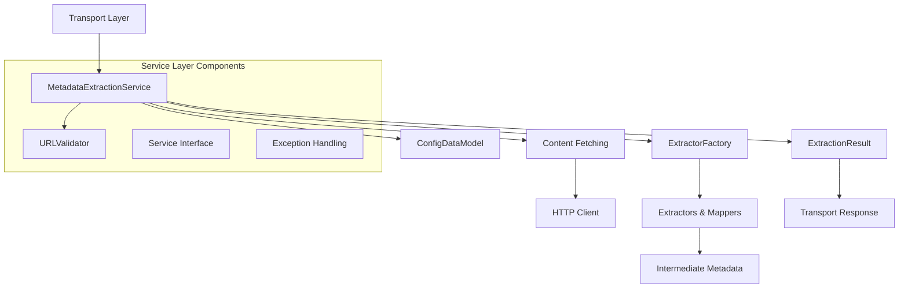
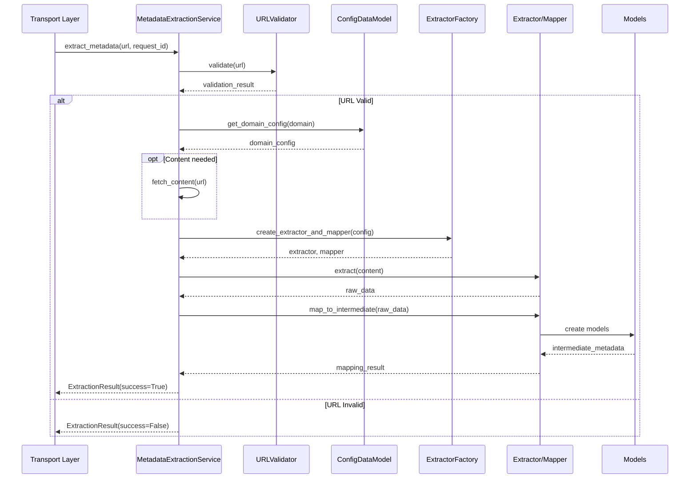

# Metadata Extraction Services

The service orchestration layer that coordinates metadata extraction workflows, URL validation, and result processing within the three-layer architecture.

## Overview

The metadata extraction services serve as the orchestration layer between configuration and transport, providing:

- **Workflow Coordination**: Manages the complete extraction pipeline
- **URL Validation**: Ensures URLs are processable and domain-supported
- **Service Abstraction**: Clean interfaces for different extraction strategies
- **Result Processing**: Standardized extraction results and error handling
- **Content Management**: HTTP content fetching and processing

## Architecture



## Core Components

### MetadataExtractionService

**Location**: `metadata_extraction_services/metadata_extraction_service.py:40-150`

The main orchestration service that coordinates the complete extraction workflow:

```python
class MetadataExtractionService(MetadataExtractionServiceInterface):
    """
    Clean, focused implementation of metadata extraction service.
    
    Orchestrates the complete extraction process:
    1. Validate URL and check domain support
    2. Load domain configuration
    3. Process content using extractors/mappers
    4. Return structured results
    """
```

**Key Responsibilities:**
- URL validation and domain configuration lookup
- HTTP content fetching (when content not provided)
- Extractor/mapper coordination via factory pattern
- Result standardization and error handling
- Performance tracking and logging

### MetadataExtractionServiceInterface

**Location**: `metadata_extraction_services/metadata_extraction_service_interface.py:17-75`

Abstract interface defining the service contract:

```python
@abstractmethod
async def extract_metadata(
    self, 
    url: str, 
    request_id: str, 
    html_content: str = None,
    document_url: str = None
) -> ExtractionResult:
    """
    Extract metadata from URL, document URL, or provided HTML content.
    
    Content Priority (first available is used):
    1. document_url - Download HTML from this URL (e.g., storage service)
    2. html_content - Use provided HTML string
    3. url - Fetch HTML from the source URL
    """
    
@abstractmethod
def validate_url(self, url: str) -> Dict[str, Any]:
    """Validate if a URL can be processed by this extraction service."""
```

**Interface Benefits:**
- **Dependency Injection**: Enable different extraction strategies
- **Strategy Pattern**: Swap extraction implementations
- **Testing**: Mock services for unit tests
- **Extension**: Add new service types without breaking existing code
- **Flexible Content**: Support multiple content retrieval methods

### URLValidator

**Location**: `metadata_extraction_services/url_validator.py:15-80`

Validates URLs for processing and extracts domain information:

```python
class UrlValidator:
    """Validates URLs and extracts domain information for processing."""
    
    def validate(self, url: str) -> Dict[str, Any]:
        """Validate URL format, accessibility, and domain support."""
        
    def extract_domain(self, url: str) -> str:
        """Extract clean domain name from URL."""
```

**Validation Process:**
1. **Format Validation**: Check URL syntax and structure
2. **Domain Extraction**: Parse domain from URL
3. **Configuration Check**: Verify domain has mapping configuration
4. **Accessibility**: Optional HTTP reachability testing

### ExtractionResult

**Location**: `metadata_extraction_services/extraction_result.py:15-60`

Standardized result container for extraction operations:

```python
@dataclass
class ExtractionResult:
    success: bool
    intermediate_metadata: Optional[IntermediateMetadata]
    request_id: str
    processing_time_seconds: float
    error_message: Optional[str] = None
    error_type: Optional[str] = None
    failed_stage: Optional[str] = None
    domain_used: Optional[str] = None
    mappers_used: List[str] = None
    artifacts_created: List[str] = None
```

## Extraction Workflow

### Complete Processing Pipeline



### Extraction Stages

1. **URL Validation**: Format and domain support checking
2. **Configuration Loading**: Retrieve domain-specific mapping rules
3. **Content Fetching**: HTTP content retrieval (if needed)
4. **Extraction**: Raw data extraction using appropriate extractor
5. **Mapping**: Convert raw data to intermediate DataCite model
6. **Result Processing**: Create standardized result structure

### Error Handling Stages

The service tracks where failures occur for debugging:

| Stage | Purpose | Common Errors |
|-------|---------|---------------|
| `url_validation` | URL format and domain check | Invalid URL, unsupported domain |
| `content_fetching` | HTTP content retrieval | Network errors, 404/403 responses |
| `extraction` | Raw data extraction | Malformed HTML, missing structured data |
| `mapping` | Model instantiation | Invalid mapping rules, validation errors |
| `result_processing` | Final result creation | Serialization errors, file I/O issues |

## Service Integration

### Configuration Integration

```python
# Service initialization with configuration
class MetadataExtractionService:
    def __init__(self, config_data_model: ConfigDataModel):
        self.config_data_model = config_data_model
        self.url_validator = UrlValidator()
        
    async def extract_metadata(self, url: str, request_id: str, html_content: str = None):
        # Use configuration to get domain settings
        domain = self.url_validator.extract_domain(url)
        domain_config = self.config_data_model.get_domain_config(domain)
```

### Factory Pattern Integration

```python
# Extractor/mapper creation via factory
extractor, mapper = extractor_factory.create_extractor_and_mapper(
    domain_config=domain_config,
    source_url=source_url
)

# Process content through extraction pipeline
extraction_result = extractor.extract(html_content)
mapping_result = mapper.map_to_intermediate(
    raw_data=extraction_result.extracted_data,
    domain_config=domain_config,
    source_url=source_url
)
```

### Transport Layer Integration

The transport layer delegates ALL business logic to the service:

```python
# Service usage in Kafka transport
class KafkaTransportService:
    def __init__(self, config: ConfigDataModel, metadata_service: MetadataExtractionService):
        self.metadata_service = metadata_service
        
    async def _handle_metadata_extraction_request(self, message, message_data):
        """Transport is agnostic - just delegates to service."""
        request = MetadataExtractionRequestEvent(**message_data)
        
        # Delegate EVERYTHING to service
        result = await self.metadata_service.extract_metadata(
            url=request.url,
            request_id=request.request_id,
            html_content=request.html_content,
            document_url=request.document_url  # Service handles this!
        )
        
        # Publish result
        if result.success:
            await self.event_publisher.publish_extraction_completed(...)
        else:
            await self._publish_failure_event(...)
```

**Key Principle**: The transport layer is **agnostic** about HOW extraction happens. It only handles messaging.

## Content Fetching

### Content Priority Strategy

The service handles content retrieval with a flexible priority system:

```python
async def extract_metadata(self, url: str, request_id: str, 
                          html_content: str = None, document_url: str = None):
    """
    Content Priority (first available is used):
    1. document_url - Download HTML from this URL (e.g., storage service)
    2. html_content - Use provided HTML string
    3. url - Fetch HTML from the source URL
    """
    if document_url:
        # Priority 1: Download from document_url
        content = await self._fetch_content_from_url(document_url)
    elif html_content:
        # Priority 2: Use provided HTML content
        content = html_content
    else:
        # Priority 3: Fetch from source URL
        content = await self._fetch_content_from_url(url)
```

### HTTP Client Integration

The service includes optional HTTP content fetching:

```python
# Optional HTTPX integration
try:
    import httpx
    HTTPX_AVAILABLE = True
except ImportError:
    HTTPX_AVAILABLE = False

async def _fetch_content_from_url(self, url: str) -> str:
    """Fetch HTML content from URL using HTTPX."""
    if not HTTPX_AVAILABLE:
        raise ContentFetchError("HTTP client not available")
        
    async with httpx.AsyncClient(timeout=30) as client:
        response = await client.get(url, follow_redirects=True)
        response.raise_for_status()
        return response.text
```

**Content Fetching Features:**
- **Optional Dependency**: HTTPX not required for provided content
- **Flexible Sources**: Support document_url, html_content, or direct URL fetch
- **Error Handling**: Clear error messages for network issues
- **Async Support**: Non-blocking content fetching
- **Timeout Management**: Configurable request timeouts
- **Follow Redirects**: Automatic redirect handling

## Performance Tracking

### Metrics Collection

```python
# Processing time tracking
start_time = time.time()
# ... processing ...
processing_time = time.time() - start_time

result = ExtractionResult(
    processing_time_seconds=processing_time,
    # ... other fields
)
```

**Tracked Metrics:**
- **Processing Time**: End-to-end extraction duration
- **Stage Timing**: Individual stage performance
- **Success Rates**: Extraction success/failure ratios
- **Error Categories**: Types and frequencies of errors

### Logging Integration

```python
# Comprehensive logging throughout workflow
logger.info(f"🔧 Starting metadata extraction for {url}")
logger.info(f"✅ Domain configuration found: {domain_config.name}")
logger.warning(f"⚠️ Content fetching failed: {error}")
logger.error(f"❌ Extraction failed at stage {stage}: {error}")
```

## Extension Patterns

### Adding New Services

1. **Implement Interface**: Extend `MetadataExtractionServiceInterface`
2. **Override Methods**: Implement required abstract methods
3. **Register Service**: Update service factory or dependency injection
4. **Add Tests**: Create comprehensive test suite

```python
class CustomExtractionService(MetadataExtractionServiceInterface):
    """Custom extraction service with specialized workflow."""
    
    async def extract_metadata(self, url: str, request_id: str, html_content: str = None):
        # Custom implementation
        pass
        
    def validate_url(self, url: str) -> Dict[str, Any]:
        # Custom validation logic
        pass
```

### Service Configuration

```python
# Service-specific configuration in app_config.yaml
app:
  extraction:
    service_type: "standard"  # or "custom", "enhanced", etc.
    timeout_seconds: 30
    retry_attempts: 3
    cache_enabled: true
```

## Error Handling

### Exception Hierarchy

```python
class ContentFetchError(Exception):
    """Raised when content cannot be fetched from URL."""
    
class ExtractionConfigError(Exception):
    """Raised when extraction configuration is invalid."""
    
class MappingValidationError(Exception):
    """Raised when mapping validation fails."""
```

### Error Recovery Strategies

1. **Graceful Degradation**: Continue with partial results
2. **Retry Logic**: Automatic retry for transient errors
3. **Fallback Extractors**: Try alternative extraction methods
4. **Error Aggregation**: Collect multiple errors for comprehensive reporting

### Error Response Format

```python
# Failed extraction result
ExtractionResult(
    success=False,
    error_message="Content fetching failed: HTTP 404 Not Found",
    error_type="ContentFetchError",
    failed_stage="content_fetching",
    processing_time_seconds=1.5,
    request_id=request_id
)
```

## Testing Support

### Service Mocking

```python
# Mock service for testing
class MockMetadataExtractionService(MetadataExtractionServiceInterface):
    async def extract_metadata(self, url: str, request_id: str, html_content: str = None):
        return ExtractionResult(
            success=True,
            intermediate_metadata=sample_metadata,
            request_id=request_id,
            processing_time_seconds=0.1
        )
```

### Test Fixtures

```python
# Service test fixtures
@pytest.fixture
def sample_extraction_service(sample_config):
    return MetadataExtractionService(sample_config)
    
@pytest.fixture
def sample_extraction_result():
    return ExtractionResult(
        success=True,
        intermediate_metadata=sample_metadata,
        request_id="test-123",
        processing_time_seconds=0.5
    )
```

## Implementation References

- **Service Implementation**: `metadata_extraction_services/metadata_extraction_service.py:40-200`
- **Interface Definition**: `metadata_extraction_services/metadata_extraction_service_interface.py:17-75`
- **URL Validation**: `metadata_extraction_services/url_validator.py:15-80`
- **Result Structure**: `metadata_extraction_services/extraction_result.py:15-60`
- **Service Usage**: `main.py:55-85` (service initialization)
- **Transport Integration**: `transport_services/kafka/kafka_transport_service.py:80-120`

---

**Service Architecture**: Orchestration layer | **Interface**: Abstract contract | **Integration**: Factory + Strategy patterns | **Performance**: Sub-second processing