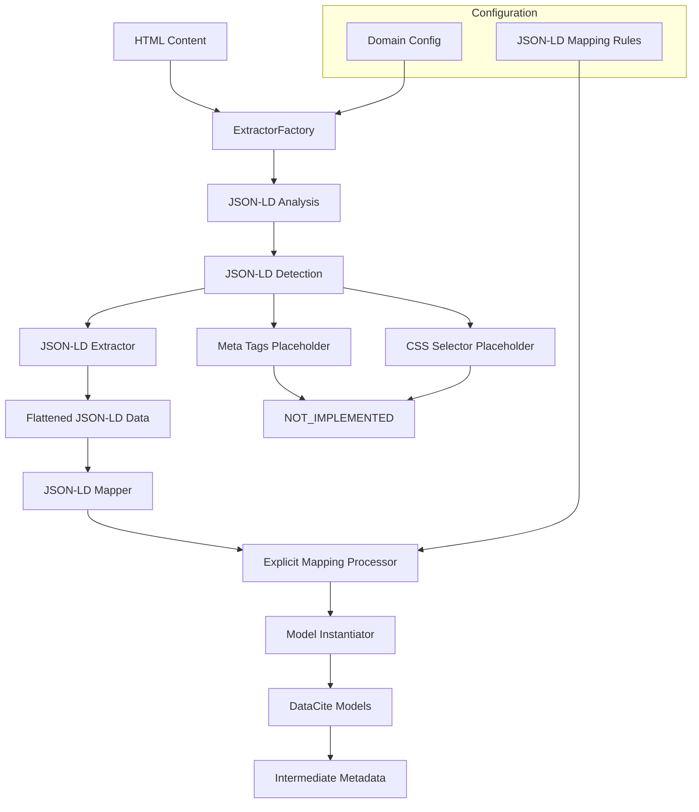

# Metadata Extractors

The core JSON-LD processing engine that extracts structured metadata from web content and converts it to DataCite intermediate format using sophisticated mapping systems.

## Overview

The metadata extractors component implements a focused architecture that specializes in JSON-LD processing. It provides:

- **JSON-LD Specialization**: Professional-grade JSON-LD to DataCite conversion
- **Dynamic Array Mapping**: `[*]` patterns for unlimited array processing
- **Explicit Mapping System**: `ClassName.property` syntax for precise mapping
- **Factory Pattern**: Intelligent JSON-LD content detection and processing
- **Configuration-Driven**: Domain-specific mapping rules via YAML

### Future Development

Additional extractors are in development:
- **Meta Tags Extractor**: HTML meta tag extraction (planned)
- **CSS Selector Extractor**: CSS-based content extraction (planned)

See [DEVELOPMENT_ROADMAP.md](../DEVELOPMENT_ROADMAP.md) for implementation timeline.

## Architecture



## Core Components

### ExtractorFactory

**Location**: `extractor_factory.py`

The factory provides intelligent content analysis and extractor selection:

```python
from metadata_extractors.extractor_factory import ExtractorFactory

factory = ExtractorFactory()
factory.register_defaults()

# Analyzes HTML and selects appropriate extractor
pair = factory.create_extractor_mapper_pair(domain_config, html_content)
extractor, mapper = pair
```

**Current Capabilities:**
- ✅ JSON-LD detection via `<script type="application/ld+json">` analysis
- ✅ Automatic JSON-LD extractor/mapper pair creation
- 🔄 Meta tags detection (placeholder - always returns False)
- 🔄 CSS selector detection (placeholder - always returns False)

### JSON-LD Extractor

**Location**: `extractors/jsonld_extractor.py`

Specialized JSON-LD processing with comprehensive feature set:

```python
from metadata_extractors.extractors.jsonld_extractor import JsonLDExtractor

extractor = JsonLDExtractor()
result = extractor.extract(html_content, source_url)

print(f"Status: {result.status.name}")
print(f"Fields: {result.metadata_count}")
print(f"Processing time: {result.processing_time_seconds}s")
```

**Features:**
- **Multi-script handling**: Processes multiple JSON-LD scripts per page
- **Hierarchical flattening**: Converts nested objects to dot notation
- **Array processing**: Handles complex array structures with indexing
- **Error resilience**: Robust parsing with detailed error reporting
- **Performance optimized**: Fast processing for production workloads

**Example Processing:**

Input JSON-LD:
```json
{
  "@context": "https://schema.org",
  "@type": "Article",
  "author": [
    {"name": "Dr. Smith", "affiliation": "University"},
    {"name": "Dr. Jones", "affiliation": "Institute"}
  ],
  "datePublished": "2024-01-15"
}
```

Flattened Output:
```python
{
  "@context": "https://schema.org",
  "@type": "Article", 
  "author[0].name": "Dr. Smith",
  "author[0].affiliation": "University",
  "author[1].name": "Dr. Jones", 
  "author[1].affiliation": "Institute",
  "datePublished": "2024-01-15"
}
```

### JSON-LD Mapper

**Location**: `mappers/jsonld_mapper.py`

Advanced configuration-driven mapping to DataCite schema:

```python
from metadata_extractors.mappers.jsonld_mapper import JsonLDMapper

# Domain configuration with mapping rules
domain_config = {
    "mapper": {
        "type": "jsonld",
        "mappings": {
            "headline": "Title.title",
            "author[*].name": "Creator.creator_name",
            "publisher.name": "Publisher.publisher",
            "datePublished": "Date.date",
            "keywords[*]": "Subject.subject"
        }
    }
}

mapper = JsonLDMapper()
result = mapper.map_to_intermediate(raw_data, domain_config, source_url)

print(f"Mapped: {result.mapped_fields_count} fields")
print(f"Skipped: {result.skipped_fields_count} fields") 
print(f"Status: {result.status.name}")
```

**Advanced Features:**
- **Array pattern matching**: `[*]` processes unlimited array elements
- **Nested property access**: `author[*].person.name` for complex structures
- **Type-aware mapping**: Automatic DataCite model instantiation
- **Validation integration**: Ensures DataCite 4.6 compliance
- **Comprehensive tracking**: Detailed field accounting and skip reasons

### Placeholder Extractors

**Locations**: 
- `extractors/meta_tags_extractor.py` 
- `extractors/css_selector_extractor.py`
- `mappers/meta_tags_mapper.py`
- `mappers/css_selector_mapper.py`

Clean placeholder implementations for future development:

```python
from metadata_extractors.extractors.meta_tags_extractor import MetaTagsExtractor

extractor = MetaTagsExtractor()
result = extractor.extract(html_content, source_url)

# Returns: ExtractionStatus.NOT_IMPLEMENTED
print(f"Status: {result.status.name}")  # "NOT_IMPLEMENTED"
print(f"Message: {result.error_message}")  # "Meta tags extraction is not yet implemented"
```

**Design Goals:**
- **Clean interfaces**: Maintain system compatibility
- **Clear messaging**: Obvious that features are not implemented
- **Future ready**: Easy to replace with real implementations
- **No surprises**: Never pretend to work when they don't

## Configuration System

### Domain Configuration

```yaml
# Example: archaeology_site.yaml
name: "arachne.dainst.org"
input_source: "html_document"
mapper:
  type: "jsonld"
  mappings:
    # Basic mapping
    "headline": "Title.title"
    
    # Nested property access  
    "author.name": "Creator.creator_name"
    "publisher.name": "Publisher.publisher"
    
    # Array processing
    "keywords[*]": "Subject.subject"
    "contributors[*].person.name": "Contributor.contributor_name"
    
    # Date handling
    "datePublished": "Date.date"
    "dateModified": "Date.date"
```

### Mapping Rule Syntax

| Pattern | Description | Example |
|---------|-------------|---------|
| `"property"` | Direct mapping | `"headline": "Title.title"` |
| `"object.property"` | Nested access | `"author.name": "Creator.creator_name"` |
| `"array[*]"` | Array processing | `"keywords[*]": "Subject.subject"` |
| `"array[*].prop"` | Nested array mapping | `"authors[*].name": "Creator.creator_name"` |

## Usage Examples

### Basic JSON-LD Processing

```python
from metadata_extractors.extractor_factory import ExtractorFactory

# HTML with JSON-LD
html = """
<html>
<head>
  <script type="application/ld+json">
  {
    "@context": "https://schema.org",
    "@type": "Article",
    "headline": "Archaeological Discovery",
    "author": {"name": "Dr. Smith"},
    "datePublished": "2024-01-15"
  }
  </script>
</head>
<body>Content</body>
</html>
"""

# Configuration
config = {
    "mapper": {
        "type": "jsonld", 
        "mappings": {
            "headline": "Title.title",
            "author.name": "Creator.creator_name",
            "datePublished": "Date.date"
        }
    }
}

# Process
factory = ExtractorFactory()
factory.register_defaults()

pair = factory.create_extractor_mapper_pair(config, html)
extractor, mapper = pair

extraction = extractor.extract(html, "https://example.org")
mapping = mapper.map_to_intermediate(extraction.raw_data, config, "https://example.org")

# Results
print(f"✅ Extracted {extraction.metadata_count} fields")
print(f"✅ Mapped {mapping.mapped_fields_count} to DataCite")
print(f"📋 Title: {mapping.intermediate_metadata.titles[0].title}")
```

### Complex Array Processing

```python
# JSON-LD with complex arrays
html = """
<script type="application/ld+json">
{
  "@context": "https://schema.org",
  "@type": "Dataset", 
  "name": "Archaeological Survey",
  "author": [
    {"@type": "Person", "name": "Dr. Smith", "affiliation": "University A"},
    {"@type": "Person", "name": "Dr. Jones", "affiliation": "University B"}
  ],
  "keywords": ["archaeology", "survey", "Roman"],
  "contributor": [
    {"@type": "Organization", "name": "Research Institute"},
    {"@type": "Person", "name": "Dr. Wilson"}
  ]
}
</script>
"""

# Advanced mapping configuration
config = {
    "mapper": {
        "type": "jsonld",
        "mappings": {
            "name": "Title.title",
            "author[*].name": "Creator.creator_name",
            "keywords[*]": "Subject.subject", 
            "contributor[*].name": "Contributor.contributor_name"
        }
    }
}

# This will create:
# - 1 Title: "Archaeological Survey"
# - 2 Creators: "Dr. Smith", "Dr. Jones" 
# - 3 Subjects: "archaeology", "survey", "Roman"
# - 2 Contributors: "Research Institute", "Dr. Wilson"
```

## Testing

Run the metadata extractor test suite:

```bash
# All extractor tests
pytest tests/test_metadata_extractor/ -v

# JSON-LD specific tests
pytest tests/test_metadata_extractor/test_extractor_jsonld.py -v
pytest tests/test_metadata_extractor/test_mapper_jsonld.py -v

# HTML parser tests  
pytest tests/test_metadata_extractor/test_html_parser.py -v

# Factory integration tests
pytest tests/test_metadata_extractor/test_extractor_factory.py -v
```

**Current Test Status:**
- ✅ JSON-LD extractor: 100% passing
- ✅ JSON-LD mapper: 100% passing
- ✅ HTML parser: 100% passing
- ✅ Factory integration: 100% passing

## Performance

**Benchmarks** (typical processing times):

| Operation | Time | Notes |
|-----------|------|-------|
| JSON-LD extraction | 0.001-0.010s | Depends on complexity |
| DataCite mapping | 0.005-0.020s | Includes validation |
| Full pipeline | 0.010-0.050s | End-to-end processing |

**Scalability**: 
- Processes 100-500 documents/second per instance
- Memory usage: ~50-100MB per instance
- CPU efficient: Single-threaded processing

## Error Handling

The system provides comprehensive error handling:

**Extraction Errors:**
- Invalid JSON syntax → `ExtractionStatus.FAILED`
- Missing JSON-LD scripts → `ExtractionStatus.FAILED`
- HTML parsing errors → Detailed error messages

**Mapping Errors:**
- Invalid mapping targets → Field skipped, logged
- Missing required DataCite fields → Intelligent defaults
- Validation failures → `MappingStatus.FAILED`

**Example Error Handling:**
```python
result = extractor.extract(html, url)

if result.status == ExtractionStatus.FAILED:
    print(f"Extraction failed: {result.error_message}")
    # Handle gracefully - maybe try different extractor
    
elif result.status == ExtractionStatus.SUCCESS:
    print(f"✅ Extracted {result.metadata_count} fields")
    # Proceed to mapping
```

## Future Development

See [DEVELOPMENT_ROADMAP.md](../DEVELOPMENT_ROADMAP.md) for:

1. **Meta Tags Extractor**: HTML meta tag processing
2. **CSS Selector Extractor**: CSS-based content extraction  
3. **Enhanced JSON-LD**: Additional schema.org types
4. **Performance Optimization**: Parallel processing capabilities
5. **Advanced Mapping**: Conditional logic and transformations

## Contributing

To extend the metadata extractors:

1. **New Extractors**: Implement `BaseExtractor` interface
2. **New Mappers**: Implement `BaseMapper` interface  
3. **Factory Integration**: Register with `ExtractorFactory`
4. **Testing**: Add comprehensive test coverage
5. **Documentation**: Update this README and guides

See the placeholder implementations for examples of the expected interface.