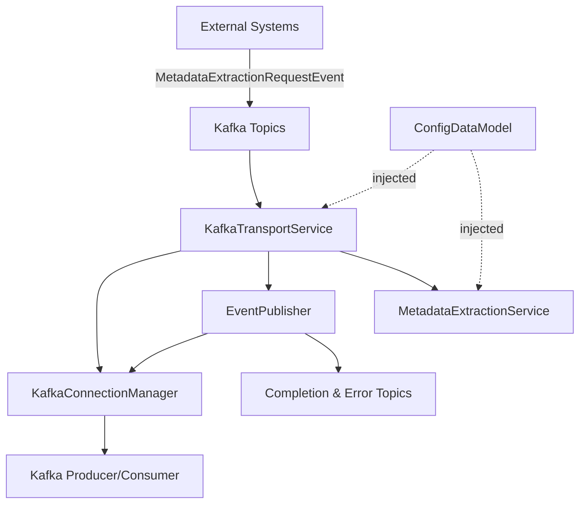
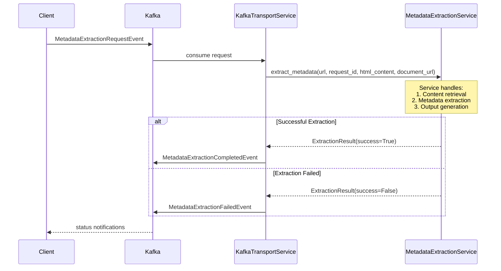

# Transport Services

The event-driven messaging layer that enables scalable, asynchronous metadata processing through Kafka-based communication patterns.

## Overview

The transport services implement the messaging infrastructure for the CIVERS Metadata Extractor, providing:

- **Event-Driven Architecture**: Kafka-based asynchronous processing
- **Scalable Messaging**: Producer/consumer patterns for high throughput
- **Clean Separation of Concerns**: Transport layer is agnostic about extraction implementation
- **Event Models**: Structured message formats for reliable communication
- **Error Handling**: Graceful error recovery and failure notifications

## Architecture

### Clean 2-Component Architecture



**Key Components**:
- **KafkaTransportService**: Main coordinator - agnostic transport layer
- **KafkaConnectionManager**: Handles all Kafka connections and health monitoring
- **EventPublisher**: Publishes events to appropriate Kafka topics with error handling
- **MetadataExtractionService**: (Injected) Handles ALL business logic and content retrieval

## Separation of Concerns

### Transport Layer Responsibilities (KafkaTransportService)

✅ **DOES:**
- Consume Kafka messages
- Parse request events from JSON
- Validate message format
- **Delegate to metadata service** (passing all parameters)
- Publish success/failure events
- Track request counts
- Manage Kafka connections

❌ **DOES NOT:**
- Download HTML content
- Make HTTP requests
- Decide content retrieval strategy
- Know about extraction implementation
- Handle business logic

### Service Layer Responsibilities (MetadataExtractionService)

✅ **DOES:**
- Handle ALL content retrieval (document_url, html_content, or URL)
- Make HTTP requests when needed
- Validate URLs and domains
- Extract metadata using extractors/mappers
- Generate JSON output files
- Return structured results

❌ **DOES NOT:**
- Know about Kafka
- Parse Kafka messages
- Publish events
- Handle transport concerns

## Core Components

### KafkaTransportService

**Location**: `kafka/kafka_transport_service.py`

The main coordinator that handles Kafka messaging with clean delegation to the service layer.

```python
class KafkaTransportService(TransportServiceInterface):
    """
    Clean transport service - agnostic about extraction implementation.
    
    Components:
    - KafkaConnectionManager: Handles producer/consumer connections
    - EventPublisher: Publishes events to Kafka topics
    - MetadataExtractionService: (Injected) Handles business logic
    """
    
    def __init__(self, config: ConfigDataModel, metadata_service: MetadataExtractionServiceInterface):
        # Initialize core components
        self.connection_manager = KafkaConnectionManager(self.kafka_config)
        self.event_publisher = EventPublisher(self.connection_manager, self.topics)
        self.metadata_service = metadata_service  # Injected dependency
```

#### Request Handling Flow

```python
async def _handle_metadata_extraction_request(self, message, message_data):
    """
    Handle metadata extraction request by delegating to the metadata service.
    
    The transport layer is agnostic about HOW extraction happens.
    
    Flow:
    1. Parse request event
    2. Call metadata extraction service (passing all parameters)
    3. Publish success or failure event
    """
    # Parse request
    extraction_request = MetadataExtractionRequestEvent(**message_data)
    
    # Delegate EVERYTHING to the metadata extraction service
    result = await self.metadata_service.extract_metadata(
        url=extraction_request.url,
        request_id=extraction_request.request_id,
        html_content=extraction_request.html_content,
        document_url=extraction_request.document_url
    )
    
    # Publish result based on success/failure
    if result.success:
        await self.event_publisher.publish_extraction_completed(...)
    else:
        await self._publish_failure_event(...)
```

### KafkaConnectionManager

**Location**: `kafka/kafka_connection_manager.py`

Manages Kafka producer and consumer lifecycle with health monitoring.

**Key Features**:
- Producer/consumer setup and teardown
- Connection health monitoring
- Graceful shutdown handling
- Error recovery

**See**: `kafka/kafka_connection_manager.md` for detailed documentation

### EventPublisher

**Location**: `kafka/event_publisher.py`

Handles publishing events to appropriate Kafka topics.

**Supported Events**:
- `MetadataExtractionCompletedEvent` - Successful extraction
- `MetadataExtractionFailedEvent` - Failed extraction
- `WorkflowProgressEvent` - Progress updates (optional)

**See**: `kafka/event_publisher.md` for detailed documentation

## Event Models

**Location**: `kafka/event_models.py`

Structured message formats for reliable communication.

### Request Event

```python
class MetadataExtractionRequestEvent(EventBaseModel):
    """Initiates metadata extraction."""
    request_id: str                   # Unique identifier
    url: str                         # Target URL for metadata
    html_content: Optional[str]      # Pre-fetched HTML (optional)
    document_url: Optional[str]      # URL to download HTML from (optional)
    output_format: str = "json"      # Output format preference
```

**Content Priority** (handled by MetadataExtractionService):
1. `document_url` - Download HTML from this URL (e.g., storage service)
2. `html_content` - Use provided HTML string
3. `url` - Fetch HTML from the source URL

### Response Events

```python
class MetadataExtractionCompletedEvent(EventBaseModel):
    """Successful extraction completion."""
    request_id: str
    url: str
    extracted_metadata: Dict[str, Any]        # Final DataCite metadata
    domain_used: str                         # Configuration domain used
    mappers_used: List[str]                  # Extraction strategies used
    processing_time_seconds: float           # Total processing time
    artifacts_created: List[str]             # Generated files
    metadata_statistics: Dict[str, Any]      # Quality metrics
    quality_assessment: Dict[str, Any]       # Quality scoring
    total_fields_extracted: int              # Number of fields
```

```python
class MetadataExtractionFailedEvent(EventBaseModel):
    """Extraction failure details."""
    request_id: str
    url: str
    error_message: str                # Detailed error description
    error_type: str                   # Exception type
    failed_stage: str                 # Stage where failure occurred
    processing_time_seconds: float    # Time until failure
    details: Dict[str, Any]           # Additional context
```

## Message Flow

### Complete Processing Workflow



### Event Processing Pipeline

1. **Request Reception**: Consume `MetadataExtractionRequestEvent` from input topic
2. **Service Delegation**: Forward request to `MetadataExtractionService` with all parameters
3. **Result Processing**: Handle extraction results (success/failure)
4. **Event Publishing**: Publish completion or failure events
5. **Metrics Update**: Track request statistics

## Kafka Configuration

### Topic Configuration

```yaml
app:
  transport:
    kafka:
      bootstrap_servers: "localhost:29092"
      topics:
        # Input topics
        metadata_extraction_requests: "metadata.extraction.requests"
        
        # Output topics
        metadata_extraction_completed: "metadata.extraction.completed"
        
        # Error handling topics
        metadata_extraction_failed: "metadata.extraction.failed"
        
      consumer_group: "metadata_extraction_group"
```

### Producer Configuration

```python
# Producer settings for reliable message delivery
producer_config = {
    'bootstrap_servers': kafka_config.bootstrap_servers,
    'value_serializer': lambda x: json.dumps(x).encode('utf-8'),
    'key_serializer': lambda x: x.encode('utf-8') if x else None,
    'acks': 'all',                    # Wait for all replicas
    'retries': 3,                     # Retry failed sends
    'retry_backoff_ms': 100,          # Backoff between retries
    'max_in_flight_requests_per_connection': 1  # Ensure ordering
}
```

### Consumer Configuration

```python
# Consumer settings for reliable message processing
consumer_config = {
    'bootstrap_servers': kafka_config.bootstrap_servers,
    'group_id': kafka_config.consumer_group,
    'auto_offset_reset': 'earliest',   # Process from beginning
    'enable_auto_commit': False,       # Manual commit for reliability
    'value_deserializer': lambda m: json.loads(m.decode('utf-8')),
    'session_timeout_ms': 30000,       # Session timeout
    'heartbeat_interval_ms': 3000      # Heartbeat frequency
}
```

## Usage Examples

### Publishing a Request

```python
# Create request event
request = MetadataExtractionRequestEvent(
    request_id="req-001",
    url="https://example.com/page",
    document_url="https://storage.example.com/doc.html"  # Optional
)

# Publish to Kafka
await transport_service.publish_metadata_extraction_request(request)
```

### Processing Flow

The KafkaTransportService automatically:
1. Consumes requests from the input topic
2. Delegates to the MetadataExtractionService
3. Publishes results to output topics

No manual intervention required - fully automated event-driven processing.

## Testing

### Unit Tests

```bash
# Run transport service tests
uv run pytest tests/transport_services/ -v
```

**Test Coverage**:
- ✅ Event publisher functionality
- ✅ Kafka connection management
- ✅ Message serialization/deserialization
- ✅ Error handling

### Integration Testing

See `tests/transport_services/` for integration tests with Kafka.

## Infrastructure Setup

### Docker Compose

```yaml
# docker-compose.yml
version: '3.8'
services:
  zookeeper:
    image: confluentinc/cp-zookeeper:latest
    environment:
      ZOOKEEPER_CLIENT_PORT: 2181
      
  kafka:
    image: confluentinc/cp-kafka:latest
    depends_on:
      - zookeeper
    ports:
      - "29092:29092"
    environment:
      KAFKA_BROKER_ID: 1
      KAFKA_ZOOKEEPER_CONNECT: zookeeper:2181
      KAFKA_ADVERTISED_LISTENERS: PLAINTEXT://localhost:29092
```

### Setup Commands

```bash
# Start Kafka infrastructure
docker-compose up -d

# Verify connectivity
uv run python scripts/civers_health_check.py
```

## Monitoring

### Health Checks

```python
# Get transport service health
info = transport_service.get_transport_info()

# Returns:
{
    'transport_type': 'KafkaTransportService',
    'capabilities': {
        'async_processing': True,
        'event_driven': True,
        'scalable': True,
        'metadata_extraction': True
    },
    'status': {
        'running': True,
        'producer_ready': True,
        'consumer_ready': True,
        'requests_processed': 42
    }
}
```

## Key Principles

> **The transport layer is agnostic about HOW extraction happens.**  
> **It only cares about receiving messages and publishing results.**

This clean separation enables:
- ✅ Easy testing (mock the service, not Kafka)
- ✅ Flexibility (can change extraction without touching transport)
- ✅ Maintainability (clear responsibilities)
- ✅ Scalability (transport and service can scale independently)

## See Also

- **`SEPARATION_OF_CONCERNS.md`** - Architecture explanation
- **`kafka/kafka_connection_manager.md`** - Connection management details
- **`kafka/event_publisher.md`** - Event publishing details
- **`metadata_extraction_services/README.md`** - Service layer documentation